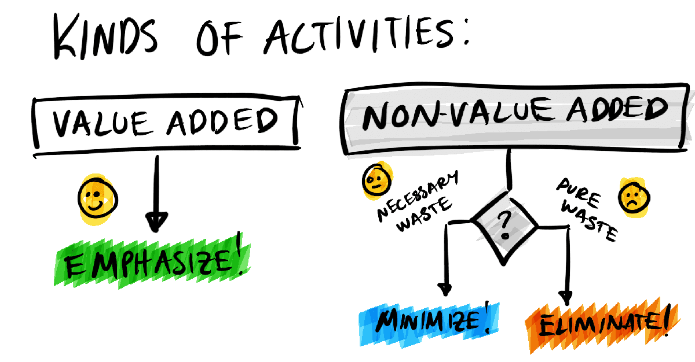

# Lean

Lean is an approach to quality that focuses on **reducing waste**, waiting time and saving money.

Lean is commonly used to find value in the process or product and maximizing it. In other words, find waste and reduce it to increase the value.

## Lean Outcomes

Outcomes of Lean:

- Reduce waste.
- Streamlining the delivery of products and services.
- Ensuring people with the right skill are in the right roles.
- Finding what we need, what we do NOT need and what we need to reduce waste and realize the opportunities.

## Lean Approach

With Lean you need to think in terms of:

- **Purpose**: The end product.
- **Process**: That leads to the end product.
- **People**: The ones who create the end product.

Lean is not an end state, Lean it is expected to be part of the culture and to be maintained.

## Lean Tools

- Kaizen
- Gemba
- Poke Yoke
- 5s

## Lean Principles

According to James P. Womack and Daniel T. Jones (1997), the 5 key principles of Lean are:

1. **Define value**: What the customer is willing to pay for.
2. **Map the value stream**: Map the whole workflow of the process/operation. This workflow must include all activities, value and non-value, ownership, and decisions/hand offs.
3. **Create a workflow**: Create a better, more streamlined workflow.
4. **Establish pull**: you must produce only when a customer demands it (this is called Pull), shifting from a "push" system that anticipates demand.
5. **Pursue perfection**: Seek for improvement after this effort is done, a.k.a continuous improvement. 

## Drawbacks Of Lean

- Data is key, if you do not have the right data Lean won't work as expected.

## History Of Lean

- Venetian 16th Century
- Henry Ford 1908
- Mass production 1926
- Deming PDCA 1930
- Japan 1950
- Toyota 1960
- Taiichi Ohno Just in Time
- Lean established 1990

## Value Adding VS NoN Value Adding

Value-added (VA) activities are those that directly contribute to a product or service in a way that the customer is willing to pay for, while non-value-added (NVA) activities are steps that consume resources without increasing value from the customer's perspective. The goal in lean manufacturing is to maximize VA activities and minimize or eliminate NVA activities to improve efficiency. 

Criteria for Value adding:

- must impact product or service positively
- customer must be willing to pay for the activity
- step must be performed correctly first time

Non valuable:

- It does not impact product or service positively
- customer is not willing to pay for the activity
- needs rework

Different combinations:

- **Valuable and necessary**
- **Valuable but not necessary** (these are just nice to have)
- **Non valuable but necessary** (inevitable things, try to minimize them), this includes legal requirements, governance requirements, company requirements.
- **Non valuable but no necessary** (pure waste, we would love to eliminate them)

## Maximizing Value

Lean is all about maximizing value.

Lean has something called `cycle time`. THis refers to the entire time a process run, from end to end, including all work and wait time that directly precedes the delivery of a product.

Cycle time enable us to see the waste and breakdown into quantifiable steps.

## Process

From the Oxford dictionary:

A process is a series of actions or steps taken in order to achieve a particular end.

Process mapping (finding all the steps currently taken), process analysis and all activities around processes are keys for Lean.

Processes in our minds:

- We **THINK** how the process should be.
- What the process **SHOULD** be.
- WHat the process **ACTUALLY** is.