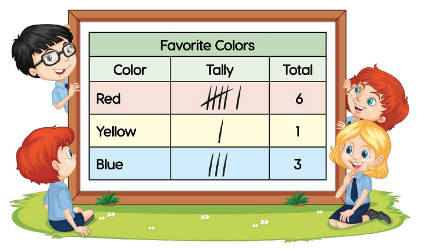
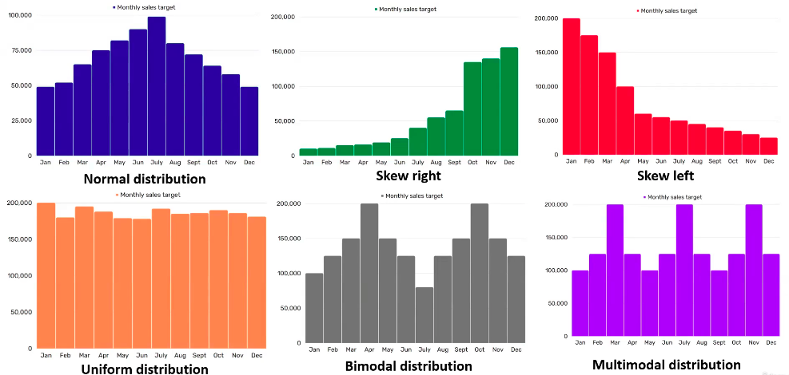
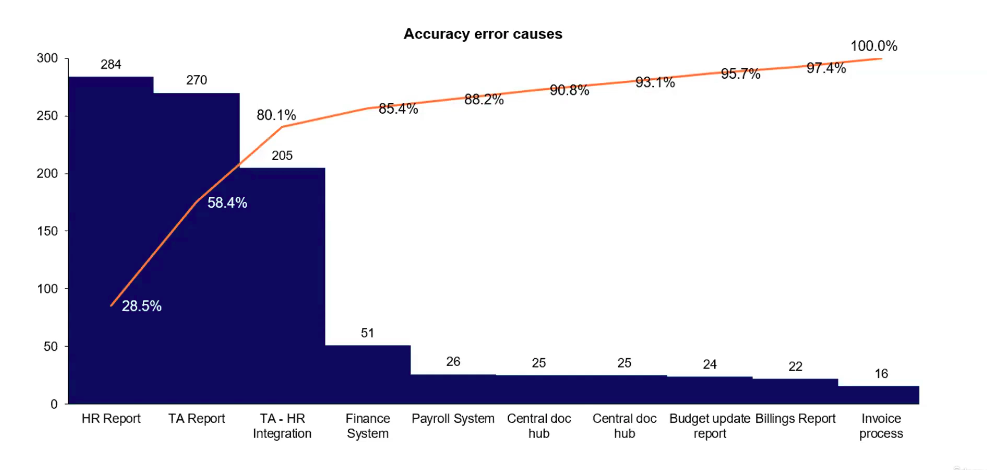
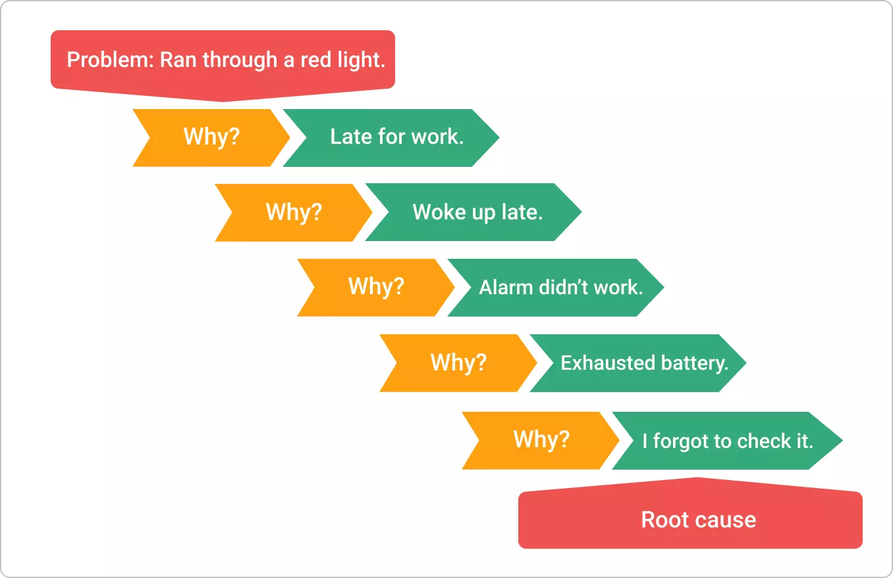
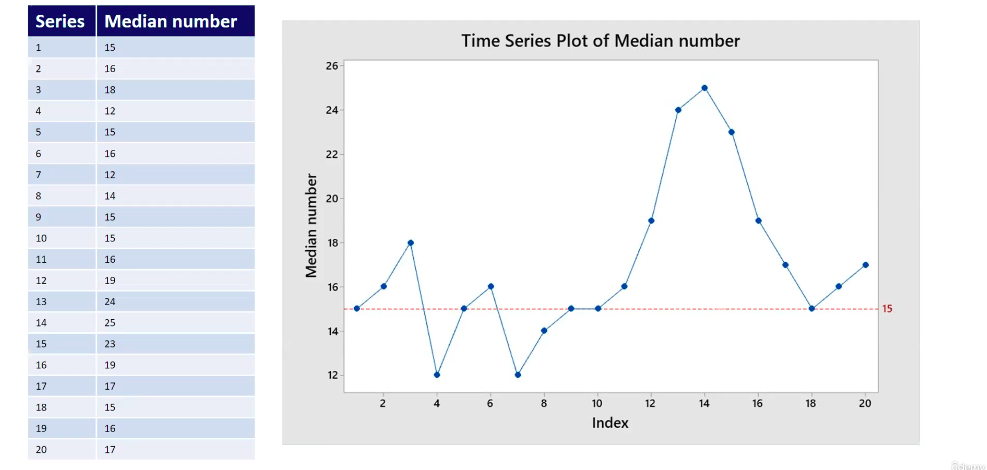

# Quality

## Quality In People

There's different kind of person in a team:

- The one that does not want help.
- The one that is excited to have some trying to improve the processes.
- The one that that say "yes we need help but we are busy"
- The one that knows how to improve the process but need guidance.
- Etc.

As a six sigma facilitor you may want to perform an **stake holder analysis** to find the people that want to receive help and are willing to spend time on finding answers and creating ideas.

## What Is Quality?

From the Oxford dictionary:

Quality is the **standard** of something when it is **compared** to **other things like it;** how good or bad something is.

> Source: https://www.oxfordlearnersdictionaries.com/definition/english/quality_1

In this definition we have some key words:

- **Standard**: Something constant
- **Compared**: It is measured using something.
- **Other things like it**: Able to replicate the same thing with the same quality.

In the terms businesses:

Quality is about making an organization **performs as your stakeholders/customer expect**.

### Examples Of Quality

Scenario: A payroll department is looking to deliver "quality" service.

After an analysis the decided that quality is delivering their monthly payroll with a 99.5 accuracy rate.

Why setting a score is important? it gives the team something to work towards and see if there is something that is making them not achieving that level.

## Critical To Quality

Critical to quality refers to the characteristics that are at the top of importance from a stakeholder/customer perspective.

> The name says everything "Critical things for quality".

If something affects directly a Critical to quality item then that "something" is considered a **defect/mistake**.

When do something for the benefit of a Critical to quality then you are improving.

Critical to quality is important because in today's world companies need to focus on this to be able to compete.

## Measuring Quality

Quality ca be measured through KPIs (key performance indicators) and SLAs (Service Of Level Agreements).

It can also be measured though the performance of the product sales, customer satisfaction, customer retention, etc.

## Quality Ownership

Quality is a job for everyone.

Almost all areas have an impact in one critical to quality, hence everyone is responsible for quality.

## ⭐ QUALITY IN LEAN SIX SIGMA (LSS)

In LSS quality is achieved by allowing 3.4 defects per 1 million opportunities or transactions.

In other words: if you perform 1 million transactions in your role, only 3.4 or less of those transactions could be incorrect or defective for your process to be seen as at Lean Six SIgma level. If you achieve this then you have achieved Quality at a LSS level.

> Achieving only 3.4 defects per million of transactions is very hard so most of the times companies want to get close to that level not really achieve that level.

## Tools Of Quality

There 7 famous tools that can be used to show quality in your organization.

1. `Process Map`
2. `Check Sheet`
3. `Histogram`
4. `Pareto Chart`
5. `Fishbone Diagram`
6. `Whys Diagram`

### The 7 Tools Of Quality

1. `Process Map`: It is a visual representation of the end to end process.
    - There are different types of process maps: flowchart, Business Process Map, value stream map, etc.

    

    > Note how the diagram above uses SIPOC (suppliers, inputs, process, outputs, customers)

2. `Check Sheet`: also referred as a defect concentration diagram or, more simply, a **tally chart**. It is used to collect and analyze data. Most of the times a check sheet looks at the frequency of something occurring.

    

3. `Histogram`: These are used to understand dist ributions.

    

    > Note how the histogram uses ranges in the x-axis for each bar not a single value as the bar chart.

    Image below shows some common distributions.
    

    - Normal Distribution: Most of the values are near to the average, data is organized forming a soft curve and symmetric.

4. `Pareto Chart`: It is use to graphically represent that which could be impacting your process or project the most. It runs on the 80-20 rule, that is, 80% of the problems can be attributed to 20% of the causes. This chart is commonly used for root cause analysis. 

    

5. `Fishbone Diagram`: also known as the cause-effect diagram or the Ishikawa diagram, as it was originally created in Japan. It is used for structured brainstorming to identify all the possible causes of a problem.

    

6. `Whys Diagram`: useful for root cause analysis, it just repeating the question why until we find the actual cause for the problem.

    

    > The why diagram is sometimes used after the fishbone diagram, you pick a few of the sub-causes and start the whys diagram for each one of them.

7. `Run Chart`: THe purpose of this diagram is to show the data points in a methodical order, the order in which they occurred. This is useful to monitor a process over time.

    